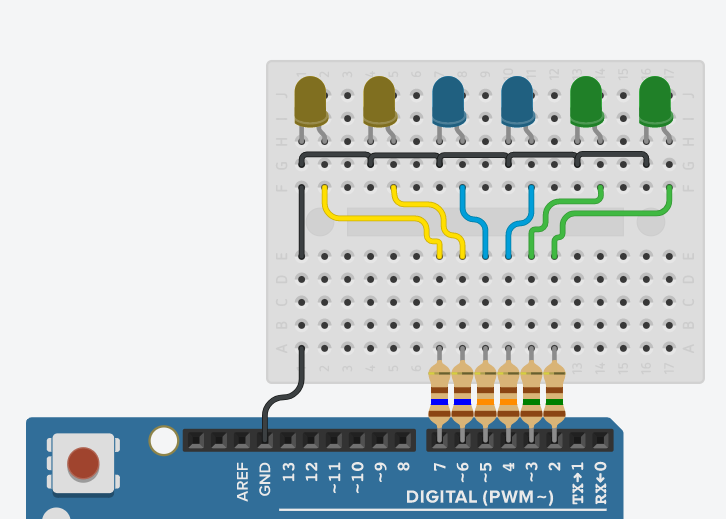

# Efect-LED

Efeitos com 6 LEDS conectados ao arduino.
Este repositório contém códigos para arduino onde gera um efeito visual com 6 LED's nas portas do arduino.

Effects with 6 LEDs connected to the arduino.
This repository contains codes for arduino where it generates a visual effect with 6 LEDs on the doors of the arduino.

************

Esta é a única montagem feita do circuito:
This is the only assembly made of the circuit:

************

No circuito há 6 LED's , 2 de cor verde, amarelo e azul, todos com resistores calculados para uma corrente de 20mA e uma alimentação de 5V. Cada LED possui uma tensão de trabalho, o valor de ressitores foi com base nesta tensão.
Resistor 160 ohm para LED amarelo.
Resistor 125 ohm para LED azul.
Resistor 150 ohm para LED verde.
Todos com negativo ( ánodo ) comum, cátodo conectado aos resistores e depois na porta 7,6,5,4,3 e 2 do Arduino.

In the circuit there are 6 LEDs, 2 green, yellow and blue, all with resistors calculated for a current of 20mA and a power of 5V. Each LED has a working voltage, the value of resitors was based on this voltage.
Resistor 160 ohm for yellow LED.
Resistor 125 ohm for blue LED.
Resistor 150 ohm for green LED.
All with negative (anode) common, cáto connected to resistors and then in arduino port 7,6,5,4,3 and 2.

************

### UPDATE 21/02/2020.